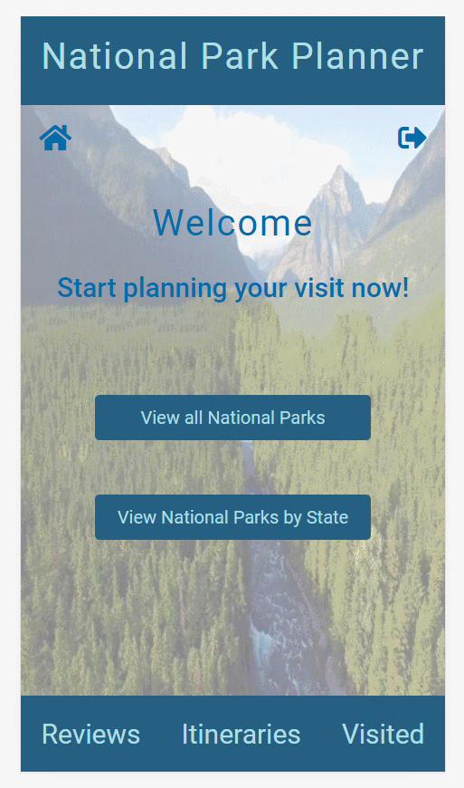

# national-park-planner

A full stack JavaScript solo project that allows users to obtain information on National Parks and helps them plan their trips.

## Technologies Used

- React.js
- Webpack 4
- Bootstrap 4
- Node.js
- Express
- PostgresQL
- HTML5
- CSS3


## Live Demo

Try the application live at [https://national-park-trip-planner.herokuapp.com/](https://national-park-trip-planner.herokuapp.com/)

## Features

- Users can view list of National Parks
- Users can search for National Parks in each state
- Users can view a summary/general weather/photos of each park
- Users can view a list of things-to-do at each NP
- Users can add items from that list to create an itinerary
- Users can view their itineraries
- Users can check off items on their itinerary as completed
- Users can review their experience in a NP
- Users can check whether reviews exist for a particular park
- Users can view a list of parks that have been reviewed
- Users can add parks to the a list of parks which they visited
- Users can view the list of parks which they visited


## Preview



## Development

### System Requirements

- Node.js 10 or higher
- NPM 6 or higher
- Postgres 10 or higher

### Getting Started

1. Clone the repository.

    ```shell
    git clone https://github.com/cbrisk/national-park-planner.git
    cd sgt-react
    ```

1. Install all dependencies with NPM.

    ```shell
    npm install
    ```

1. Import the example database to PostgresQL.

    ```shell
    npm run db:import
    ```

1. Start the project. Once started you can view the application by opening http://localhost:3000 in your browser.

    ```shell
    npm run dev
    ```
